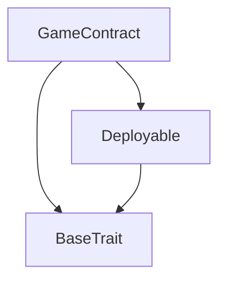
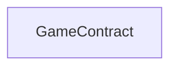

# Tact compilation report
Contract: GameContract
BoC Size: 3507 bytes

## Structures (Structs and Messages)
Total structures: 22

### DataSize
TL-B: `_ cells:int257 bits:int257 refs:int257 = DataSize`
Signature: `DataSize{cells:int257,bits:int257,refs:int257}`

### SignedBundle
TL-B: `_ signature:fixed_bytes64 signedData:remainder<slice> = SignedBundle`
Signature: `SignedBundle{signature:fixed_bytes64,signedData:remainder<slice>}`

### StateInit
TL-B: `_ code:^cell data:^cell = StateInit`
Signature: `StateInit{code:^cell,data:^cell}`

### Context
TL-B: `_ bounceable:bool sender:address value:int257 raw:^slice = Context`
Signature: `Context{bounceable:bool,sender:address,value:int257,raw:^slice}`

### SendParameters
TL-B: `_ mode:int257 body:Maybe ^cell code:Maybe ^cell data:Maybe ^cell value:int257 to:address bounce:bool = SendParameters`
Signature: `SendParameters{mode:int257,body:Maybe ^cell,code:Maybe ^cell,data:Maybe ^cell,value:int257,to:address,bounce:bool}`

### MessageParameters
TL-B: `_ mode:int257 body:Maybe ^cell value:int257 to:address bounce:bool = MessageParameters`
Signature: `MessageParameters{mode:int257,body:Maybe ^cell,value:int257,to:address,bounce:bool}`

### DeployParameters
TL-B: `_ mode:int257 body:Maybe ^cell value:int257 bounce:bool init:StateInit{code:^cell,data:^cell} = DeployParameters`
Signature: `DeployParameters{mode:int257,body:Maybe ^cell,value:int257,bounce:bool,init:StateInit{code:^cell,data:^cell}}`

### StdAddress
TL-B: `_ workchain:int8 address:uint256 = StdAddress`
Signature: `StdAddress{workchain:int8,address:uint256}`

### VarAddress
TL-B: `_ workchain:int32 address:^slice = VarAddress`
Signature: `VarAddress{workchain:int32,address:^slice}`

### BasechainAddress
TL-B: `_ hash:Maybe int257 = BasechainAddress`
Signature: `BasechainAddress{hash:Maybe int257}`

### Deploy
TL-B: `deploy#946a98b6 queryId:uint64 = Deploy`
Signature: `Deploy{queryId:uint64}`

### DeployOk
TL-B: `deploy_ok#aff90f57 queryId:uint64 = DeployOk`
Signature: `DeployOk{queryId:uint64}`

### FactoryDeploy
TL-B: `factory_deploy#6d0ff13b queryId:uint64 cashback:address = FactoryDeploy`
Signature: `FactoryDeploy{queryId:uint64,cashback:address}`

### CreateRound
TL-B: `create_round#efc98a57 stakeTON:coins mode:uint8 deadline:uint32 targetParticipants:uint16 = CreateRound`
Signature: `CreateRound{stakeTON:coins,mode:uint8,deadline:uint32,targetParticipants:uint16}`

### JoinRound
TL-B: `join_round#56aaf0ad roundId:uint32 referrer:address = JoinRound`
Signature: `JoinRound{roundId:uint32,referrer:address}`

### DistributeRound
TL-B: `distribute_round#b86067a5 roundId:uint32 seed:uint256 blockHash:uint256 = DistributeRound`
Signature: `DistributeRound{roundId:uint32,seed:uint256,blockHash:uint256}`

### SetReferrer
TL-B: `set_referrer#1576d9ae inviter:address = SetReferrer`
Signature: `SetReferrer{inviter:address}`

### ReferralReward
TL-B: `referral_reward#ca876917 fromUser:address amount:coins roundId:uint32 = ReferralReward`
Signature: `ReferralReward{fromUser:address,amount:coins,roundId:uint32}`

### UpdateFee
TL-B: `update_fee#ae1c1357 platformFeePercent:int257 referralPercent:int257 = UpdateFee`
Signature: `UpdateFee{platformFeePercent:int257,referralPercent:int257}`

### Round
TL-B: `_ id:uint32 creator:address stakeTON:coins mode:uint8 status:uint8 participants:dict<address, bool> participantsList:dict<int, address> participantsCount:uint16 deadline:uint32 targetParticipants:uint16 bank:coins platformFee:coins distributedAt:uint32 seed:uint256 blockHash:uint256 = Round`
Signature: `Round{id:uint32,creator:address,stakeTON:coins,mode:uint8,status:uint8,participants:dict<address, bool>,participantsList:dict<int, address>,participantsCount:uint16,deadline:uint32,targetParticipants:uint16,bank:coins,platformFee:coins,distributedAt:uint32,seed:uint256,blockHash:uint256}`

### ReferralStats
TL-B: `_ totalInvited:uint16 totalEarned:coins totalRewards:uint16 = ReferralStats`
Signature: `ReferralStats{totalInvited:uint16,totalEarned:coins,totalRewards:uint16}`

### GameContract$Data
TL-B: `_ admin:address platformFeePercent:uint8 referralPercent:uint8 roundsCount:uint32 rounds:dict<int, ^Round{id:uint32,creator:address,stakeTON:coins,mode:uint8,status:uint8,participants:dict<address, bool>,participantsList:dict<int, address>,participantsCount:uint16,deadline:uint32,targetParticipants:uint16,bank:coins,platformFee:coins,distributedAt:uint32,seed:uint256,blockHash:uint256}> referrerOf:dict<address, address> referralStats:dict<address, ^ReferralStats{totalInvited:uint16,totalEarned:coins,totalRewards:uint16}> minStakeTON:coins maxStakeTON:coins minParticipants:uint16 maxParticipants:uint16 = GameContract`
Signature: `GameContract{admin:address,platformFeePercent:uint8,referralPercent:uint8,roundsCount:uint32,rounds:dict<int, ^Round{id:uint32,creator:address,stakeTON:coins,mode:uint8,status:uint8,participants:dict<address, bool>,participantsList:dict<int, address>,participantsCount:uint16,deadline:uint32,targetParticipants:uint16,bank:coins,platformFee:coins,distributedAt:uint32,seed:uint256,blockHash:uint256}>,referrerOf:dict<address, address>,referralStats:dict<address, ^ReferralStats{totalInvited:uint16,totalEarned:coins,totalRewards:uint16}>,minStakeTON:coins,maxStakeTON:coins,minParticipants:uint16,maxParticipants:uint16}`

## Get methods
Total get methods: 6

## getRound
Argument: roundId

## getReferrer
Argument: user

## getReferralStats
Argument: user

## getTotalRounds
No arguments

## getPlatformFeePercent
No arguments

## getReferralPercent
No arguments

## Exit codes
* 2: Stack underflow
* 3: Stack overflow
* 4: Integer overflow
* 5: Integer out of expected range
* 6: Invalid opcode
* 7: Type check error
* 8: Cell overflow
* 9: Cell underflow
* 10: Dictionary error
* 11: 'Unknown' error
* 12: Fatal error
* 13: Out of gas error
* 14: Virtualization error
* 32: Action list is invalid
* 33: Action list is too long
* 34: Action is invalid or not supported
* 35: Invalid source address in outbound message
* 36: Invalid destination address in outbound message
* 37: Not enough Toncoin
* 38: Not enough extra currencies
* 39: Outbound message does not fit into a cell after rewriting
* 40: Cannot process a message
* 41: Library reference is null
* 42: Library change action error
* 43: Exceeded maximum number of cells in the library or the maximum depth of the Merkle tree
* 50: Account state size exceeded limits
* 128: Null reference exception
* 129: Invalid serialization prefix
* 130: Invalid incoming message
* 131: Constraints error
* 132: Access denied
* 133: Contract stopped
* 134: Invalid argument
* 135: Code of a contract was not found
* 136: Invalid standard address
* 138: Not a basechain address
* 1409: Already participating
* 2805: Insufficient value
* 3502: Only admin can distribute
* 4925: Round not open
* 9959: Stake too low
* 12339: Cannot refer yourself
* 16461: Only admin
* 19465: Invalid referral percent
* 29056: Not enough participants
* 32542: Stake too high
* 34371: Round not locked
* 46812: Referral exceeds fee
* 52756: Insufficient value for stake and gas
* 54203: Referrer already set
* 62817: Invalid platform fee

## Trait inheritance diagram

## Contract dependency diagram

